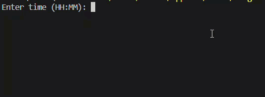
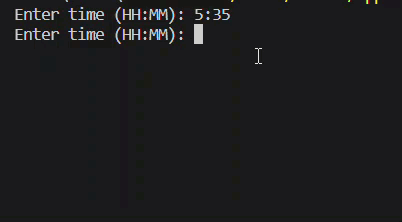
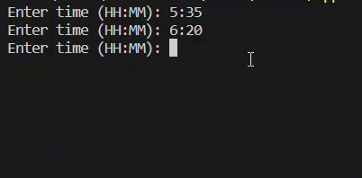

# SAP-time-manager
Python script to add up worked hours and convert to SAP (decimal) time

## Preconditions
This Python script requires the [colorama](https://github.com/tartley/colorama) library

`pip install colorama`

## How it works
A prompt will show up to enter one recording in the format of HH:MM

Enter the recording and press ENTER

If you wish to add up more time, simply repeat the action

To show the final time, press ENTER while not inputing any recording

Thank you for using my software *uwu*

